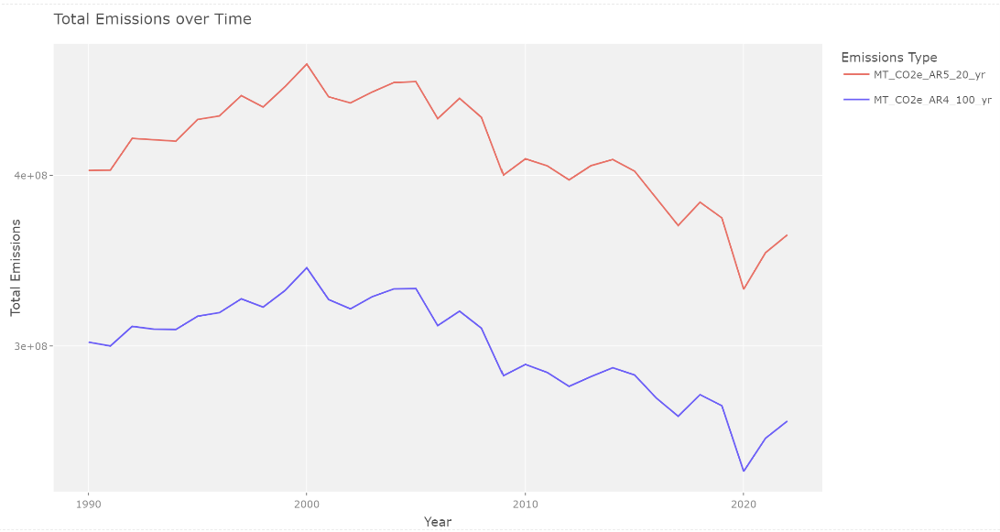
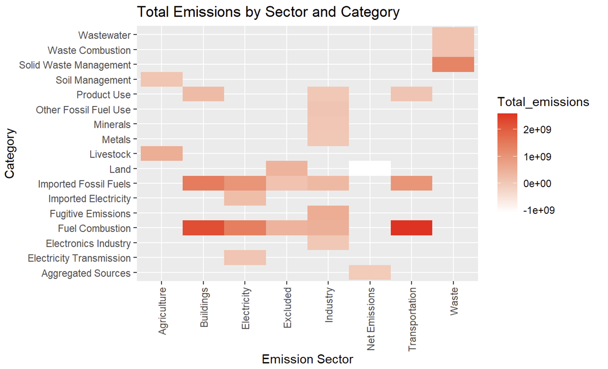
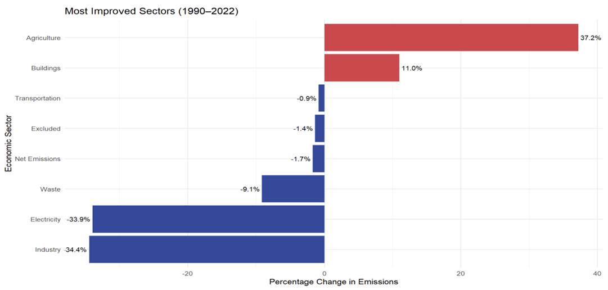

# Greenhouse Gas Emissions Analysis — R Data Wrangling & Visualization

> An end-to-end **data wrangling and visualization** project in R: cleaning an 18K-row public dataset and building nine `ggplot2` visualizations to reveal three decades of emissions trends across sectors, gases, and time.

## What This Project Demonstrates

This is a data-analysis showcase built entirely in R, end to end:

- **Data wrangling** — cleaning, validating, grouping, and reshaping a messy 18,183-row, 13-column public dataset into analysis-ready form with `dplyr` and the `tidyverse`
- **Visualization design** — nine `ggplot2` charts spanning line plots, stacked bars, heatmaps, faceted small-multiples, and interactive `plotly` graphics
- **Analytical storytelling** — turning raw rows into a clear, structured narrative about where emissions come from and how they've shifted over time

The dataset (NY State greenhouse-gas emissions, 1990–2022, from Data.gov) is the vehicle; the focus is the R workflow and the quality of the visual analysis.

## Data Wrangling Workflow

- **Validation-first cleaning:** used an LLM to flag null and zero-value rows, then **independently re-verified every removal in R** (`filter(is.na())`, zero-counts) to confirm the cleaned row counts matched exactly — automation paired with a manual audit
- **Quality checks:** found and removed 4,505 zero-value rows in the 20-yr column and 4,538 in the 100-yr column that would have skewed the analysis
- **Reshaping:** `group_by()` + `summarise()` to aggregate emissions by year, sector, gas, and category; `mutate()` for derived metrics like 1990–2022 percentage change
- **Comparison framing:** short-term (20-yr GWP) vs long-term (100-yr GWP) global-warming-potential measures carried through every view

## Visualization Highlights

Nine figures, each built with `ggplot2`:

A `geom_tile()` heatmap mapping emissions across sectors and categories — surfacing exactly where emissions concentrate (Fuel Combustion in Transportation/Buildings; Livestock in Agriculture).

A ranked `geom_col()` chart of 1990–2022 change by sector, immediately readable as "who improved, who didn't."

Other figures use `geom_line()` time series, stacked `geom_bar()` sector comparisons, `facet_wrap()` per-sector small-multiples, and `plotly` for interactivity.

## Techniques & Tools

| Area | What I used |
|---|---|
| Wrangling | `dplyr`, `tidyverse` — `group_by`, `summarise`, `mutate`, `filter` |
| Visualization | `ggplot2` — `geom_line`, `geom_col`, `geom_tile`, `facet_wrap`; `plotly` |
| Data validation | manual cross-checks in R against LLM-assisted cleaning |
| Reporting | R Markdown (`.Rmd`) knit to a full written report |

## Repository Structure

    Project.Rmd        # full R Markdown analysis: cleaning → wrangling → 9 visualizations
    figures/           # exported plots
    README.md

## Data

Public dataset from [Data.gov](https://data.gov): "Statewide Greenhouse Gas Emissions: Beginning 1990." Place the CSV in the repo root before knitting.

## Key Insights (from the analysis)

CO₂ dominates total emissions, followed by CH₄; Transportation and Buildings are the largest sectors; emissions peaked around 2000 and hit a low in 2020; and from 1990–2022 Agriculture rose ~37% while Electricity fell ~10%. Full interpretation is in [Report_sumaya.pdf](Report_sumaya.pdf).

## License

Released under the MIT License — see [LICENSE](LICENSE).
